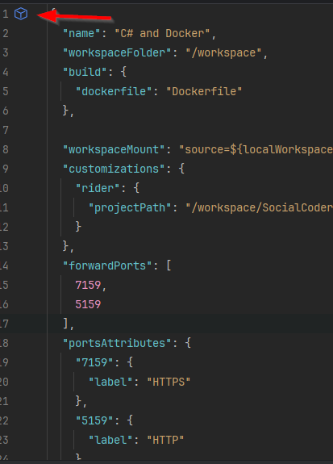
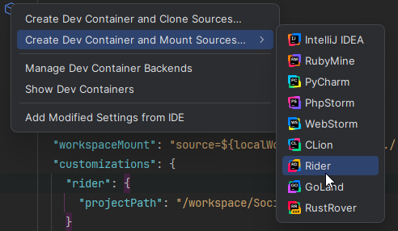
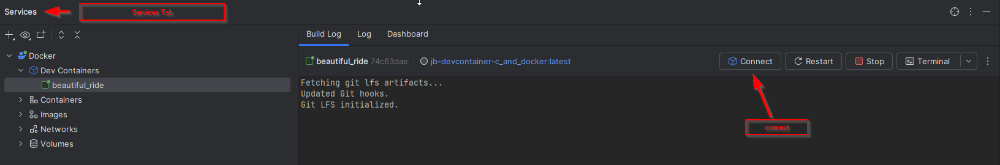

# IDE

This is ultimately developer preference. These are the suggested IDEs

**Free**

[Visual Studio Code](https://code.visualstudio.com/download)

[Visual Studio 2022](https://visualstudio.microsoft.com/vs/)

**Free for open source**

[JetBrains Rider](https://www.jetbrains.com/rider/download/#section=windows)

-----

# Dev Container

Rather than installing a bunch of stuff locally, such as the right dotnet SDK you can use a dev container!

You will, however, need to have docker installed locally.

## Rider

Click the blue cube,

Then press **Create Dev Container and Mount Sources -> Rider**

Rider will then create the dev-container, mounting Rider's backend IDE. When
 complete, you will be able to connect to the dev-container.

-----

# Framework
We're utilizing C# Net 9.0 right now
[Net 9.0](https://dotnet.microsoft.com/en-us/download/dotnet/9.0)

We're using Discord.NET as our bot library

[Discord.Net Doc Site](https://discordnet.dev/)

[Discord.NET Github](https://github.com/discord-net/Discord.Net)

# Docker

Having docker installed is required as it can be used for the dev container, along with running the services.

[Docker](https://docs.docker.com/get-docker/)

# Misc
Make sure you have [Git](https://git-scm.com/downloads) installed on your machine!

