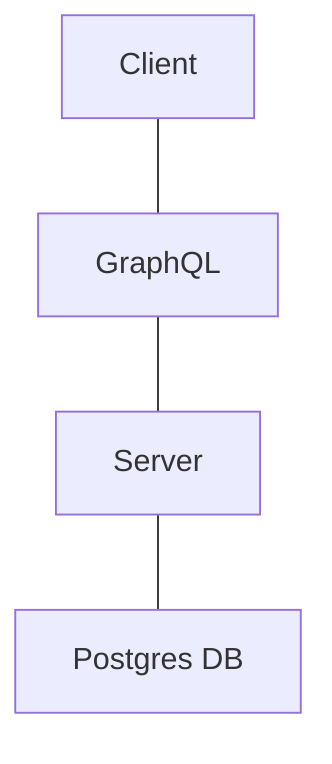

# Status
[](https://github.com/Programming-Simplified-Community/Social-Coder/actions/workflows/codeql-analysis.yml)
[](https://github.com/programming-simplified-community/social-coder/actions?query=workflow%3AMegaLinter+branch%3Amain)


# Social Coder

This project is geared towards building a social-media like experience for programmers!

Clearly, this is a work in progress app but here's a sneak peak on current progress!

1. OAuth login via Google or Discord (will add more)
2. Ability to view code jams
3. Ability to register/withdraw from code jams

If you're interested in contributing here's [Environment](Environment.md) setup instructions/suggestions.

Of course, no app is complete without a [Database](Database.md)!

# Development Tool

We recognized the fact developers may want to develop from their favorite operating system. Windows, Linux, or Mac. Issue is having utility scripts
that work across different platforms! Python? - well now everyone needs to install Python. PowerShell? Everyone needs PowerShell now. Instead, we made our own
CLI tool using C#! Sure, it's a `dotnet tool` which requires install but... it works across different platforms **and** is included in the repo!
More importantly, since this is a C# project you'll have `dotnet` on your devbox!

### Install dev tool

Assumes you're running this from project root directory
```bash
dotnet tool install -g programming-simplified-community-dev-tool --add-source ./SocialCoder.CLI/nupkg
```

### Uninstall dev tool

Doesn't matter where you execute this from
```bash
dotnet tool uninstall -g programming-simplified-community-dev-tool
```

### Getting started

Please make sure you have the following `dotnet tool` installed as it's a dependency to apply db migrations. The following command installs the tool at a global level 
(can use it in multiple projects)
```bash
dotnet tool install --global dotnet-ef
```

You'll want to get your project settings rolling in order to successfully bring up the application!

`ProjectPath` is the most important one.

This gives you a wizard like experience where you provide values, or use defaults
```bash
social-dev init
```

If you need to update a specific value.
```bash
social-dev settings
```

Once you have at least ran through the `init` wizard you can then start up the database via `start-db`. It spools up a docker container,
waits for it to come online, then applies database migrations! 

```bash
social-dev start-db
```

At this point the only outstanding piece to get the app running is the OAuth portion. Technically you can run the app but you won't be able to login.

## Services

After some research we have determined that we needed something a bit better than standard REST endpoints between our **client** and **server**. 
Though we're noobs to implement GraphQL, it looks like an excellent long-term solution for loading an entire pages worth of data in one go... compared to
calling `N` amount of endpoints for `N` components on screen.



## Login
There are no default credentials. Must utilize OAuth! Please note: when the application first starts up (with a clean DB), the first user to login gets designated as the `owner` who has the highest privileges.
Idea being you deploy the application and are 99% most likely to be the same one who logs in to test/verify things are running.

## OAuth Setup

Will require adding a `appsettings.development.json` to your Server project [SocialCoder.Web](SocialCoder.Web)

```json
{
  "Authentication": {
    "ProviderName": {
      "ClientId": "",
      "ClientSecret": ""
    }
  }
}
```

#### Discord

[Discord Developer Portal](https://discord.com/developers/applications)

- Create an application (if you don't have one already)
- Go to OAuth2 panel
  - Grab both the `Client ID` and `Client Secret` and put them into the appropriate place in your `appsettings.development.json`. The ProviderName for this will be `Discord`... because....it's... discord.
  - Update the redirect to be `https://localhost:7159/signin-discord`

#### Google

[Google Portal](https://console.cloud.google.com)

- Create a project to use for testing
- Go to API & Services --> Credentials
  - Create Credentials 
    - Add Authorized `JavaScript origins`: `https://localhost:7159`
    - Authorized Redirect URIs: `https://localhost:7159/signin-google`
    - Save and grab the `Client ID` and `Client Secret`. Shove this into `Google`. Should be self explanatory that the pattern here is `ProviderName` equals the Service name we're using for OAuth.

#### Github

[Register Github App](https://github.com/settings/applications/new)

- Application name can be whatever you want for testing purposes.
- Homepage URL
  - https://github.com/Programming-Simplified-Community/Social-Coder
- Authorization callback URL
  - https://localhost:7159/signin-github
- Grab the ClientID, and ClientSecret and put them in the `appsettings.development.json` file under `Github`