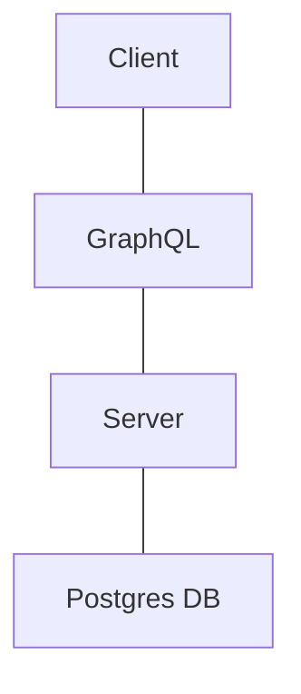

# Status

# Social Coder

This project is geared towards building a social-media-like experience for programmers!

Clearly, this is a work in progress app but here's a sneak peak on current progress!

1. OAuth login via Google, Discord, GitHub (will add more)
2. Ability to view code jams
3. Ability to register/withdraw from code jams

## Contributing

If you're interested in contributing here's [Environment](Environment.md) setup instructions/suggestions.

Of course, no app is complete without a [Database](Database.md)!

## Services

After some research we have determined that we needed something a bit better than standard REST endpoints between our **client** and **server**. 
Though we're noobs to implement GraphQL, it looks like an excellent long-term solution for loading an entire pages worth of data in one go... compared to
calling `N` amount of endpoints for `N` components on screen.

## Login
There are no default credentials. Must use OAuth.

## OAuth Setup

During the first launch of the application, you will see a "setup-mode." While in this mode, the application is not 
usable. You're required to ensure that you have at least one OAuth provider, and a valid database connection.

Once both requirements are satisfied, you can finalize the setup by clicking the "Finish Setup" button. Then the server
will shut down. If not in a container, you will have to restart it by hand. Otherwise, via docker-compose, the restart policy should
kick in and restart automatically.

#### Discord

[Discord Developer Portal](https://discord.com/developers/applications)

- Create an application (if you don't have one already)
- Go to OAuth2 panel
  - Grab both the `Client ID` and `Client Secret` and put them into the appropriate place in your `appsettings.development.json`. The ProviderName for this will be `Discord`... because....it's... discord.
  - Update the redirect to be `https://localhost:7159/signin-discord`

#### Google

[Google Portal](https://console.cloud.google.com)

- Create a project to use for testing
- Go to API & Services --> Credentials
  - Create Credentials 
    - Add Authorized `JavaScript origins`: `https://localhost:7159`
    - Authorized Redirect URIs: `https://localhost:7159/signin-google`
    - Save and grab the `Client ID` and `Client Secret`. Shove this into `Google`. Should be self explanatory that the pattern here is `ProviderName` equals the Service name we're using for OAuth.

#### Github

[Register Github App](https://github.com/settings/applications/new)

- Application name can be whatever you want for testing purposes.
- Homepage URL
  - https://github.com/Programming-Simplified-Community/Social-Coder
- Authorization callback URL
  - https://localhost:7159/signin-github
- Grab the ClientID, and ClientSecret and put them in the `appsettings.development.json` file under `Github`